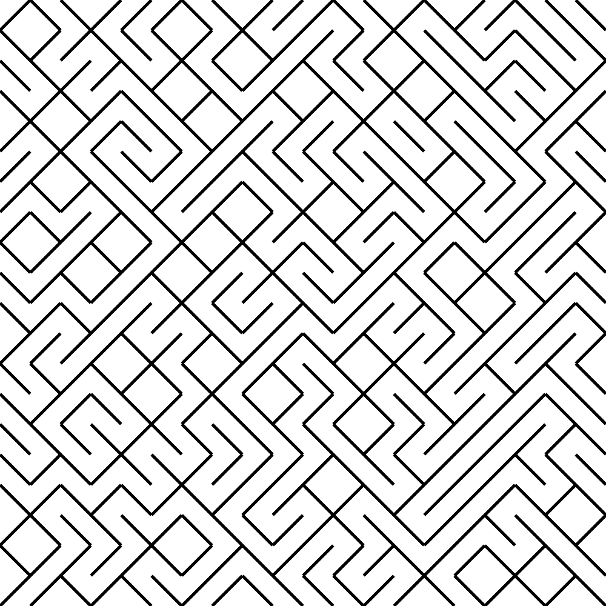
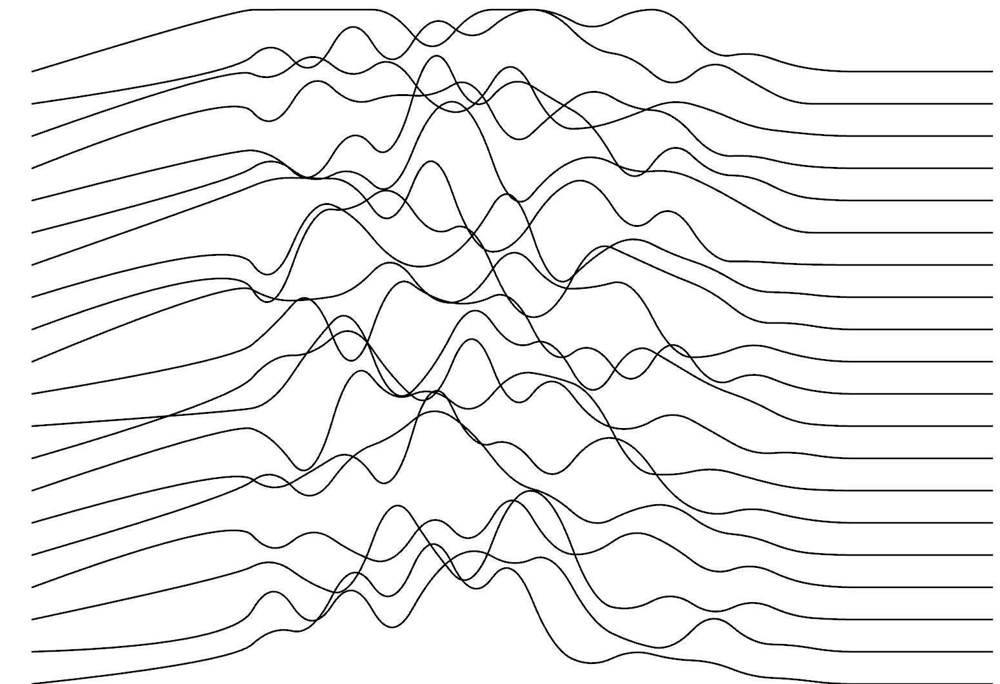
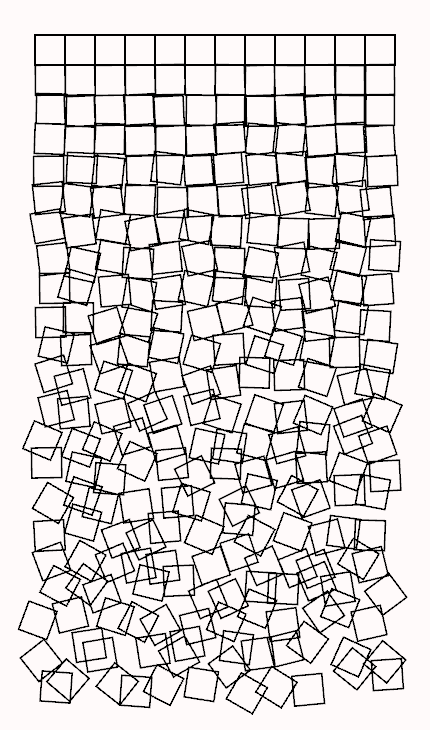
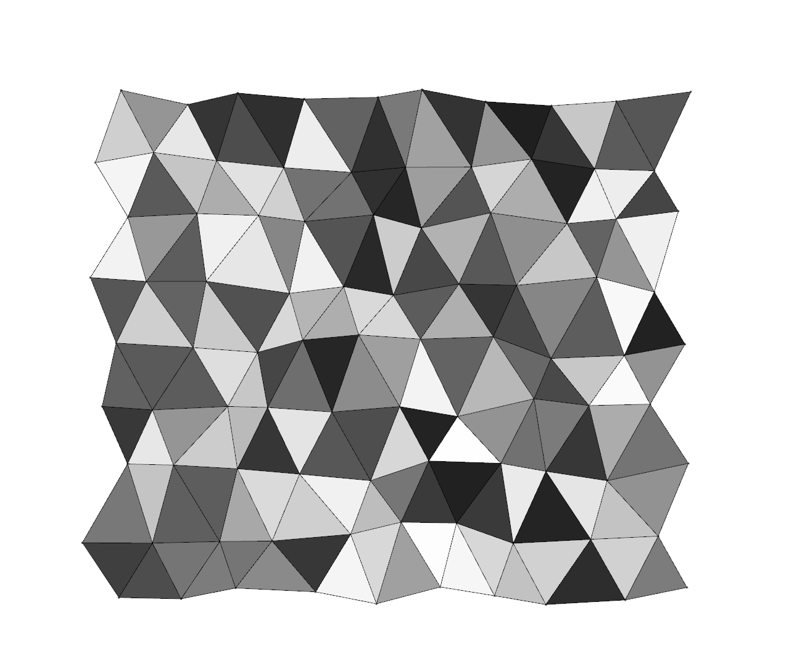
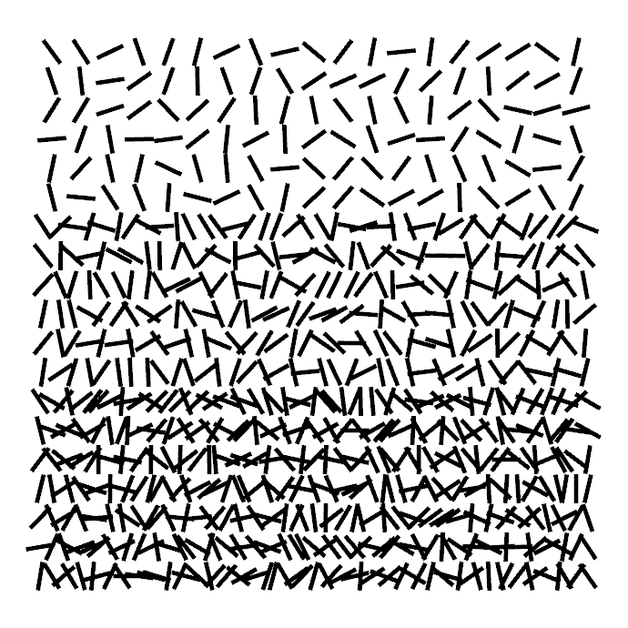
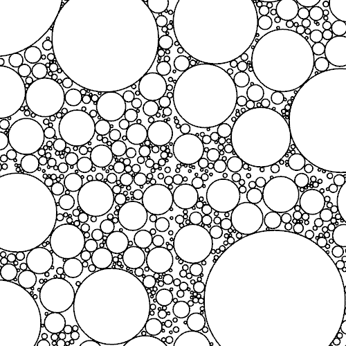
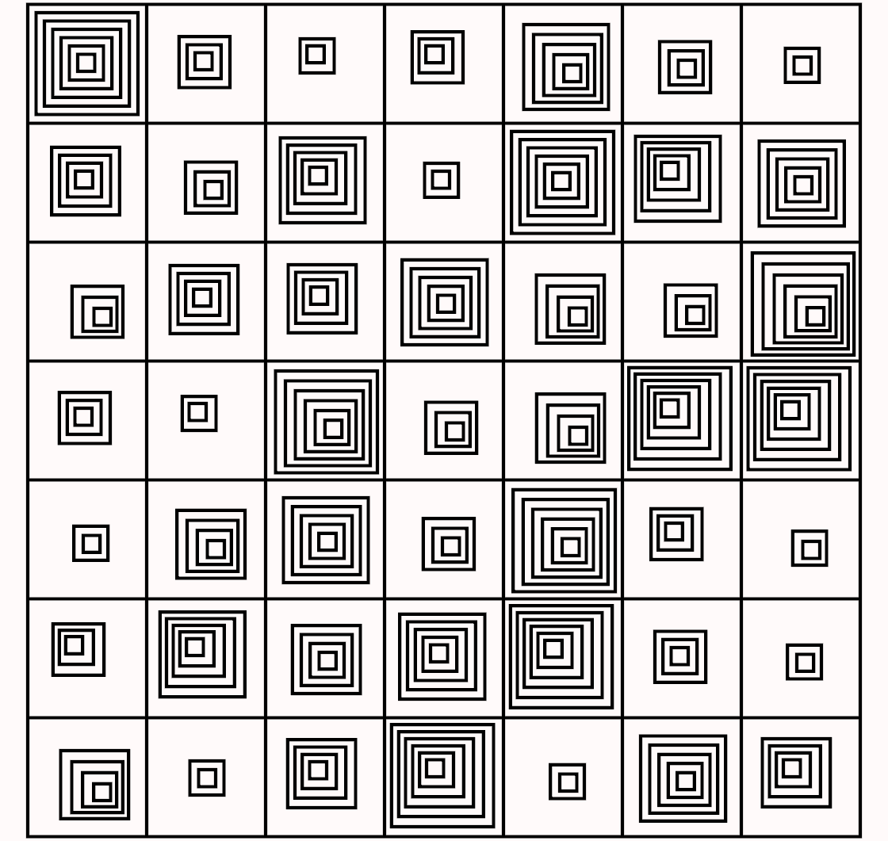
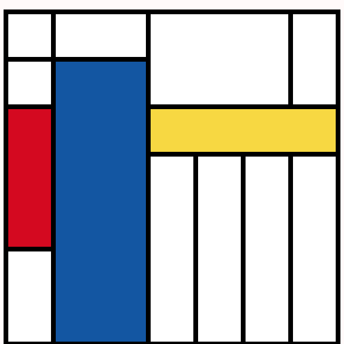
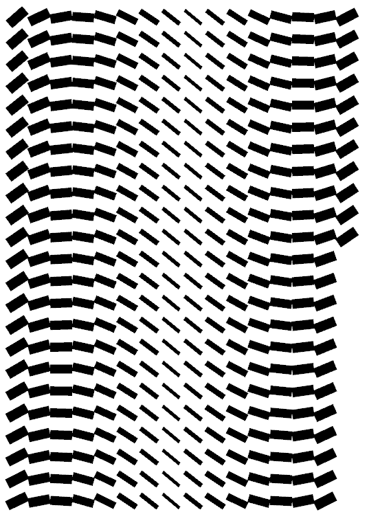

All these tutorials are based on the generative artistry tutorials [here](https://generativeartistry.com/tutorials/) 

The tutorials are using a Rust "workspace", which you can run any tutorials by executing
```
cargo run --release -p tutorial_{num}
```

|     |     |     |
| :---: |:---:|:---:|
| Tutorial 1 (Tiled Lines) | Tutorial 2 (Joy Division) | Tutorial 3 (Cubic Disarray)|
| [](tutorial_1/src/main.rs)| [](tutorial_2/src/main.rs)| [](tutorial_3/src/main.rs)|
| Tutorial 4 (Triangular Mesh) | Tutorial 5 (Un Deux Trois) | Tutorial 6 (Circle Packing)|
| [](tutorial_4/src/main.rs)| [](tutorial_5/src/main.rs)| [](tutorial_6/src/main.rs)|
| Tutorial 7 (Hypnotic Squares) | Tutorial 8 (Piet Mondrian) | Tutorial 9 (Hours of Dark)|
| [](tutorial_7/src/main.rs)| [](tutorial_8/src/main.rs)| [](tutorial_9/src/main.rs)|
