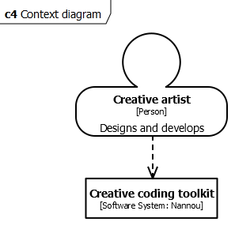

# Developer Reference

The following diagrams are made to visualize the architecture of Nannou. These are created using the C4 diagram standard (see: https://www.c4model.com) with Graphor (see: https://gaphor.org), for which the source is included in (./diagrams/nannou.gaphor).

## Assistive tooling
While developing with Nannou, the following tooling is available:
#tooling_component_diagram.png

## Architecture
It all starts with the creative artist deciding what to create:
#developer_context.png  
      

#container_diagram.png  
      

#application_component_diagram.png  
    
