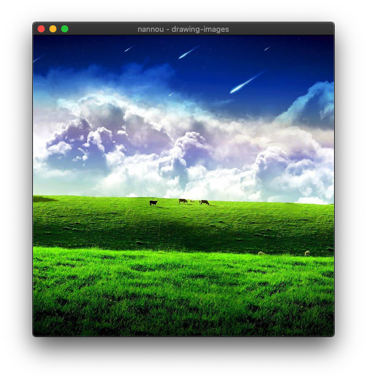

# Drawing Images

**Tutorial Info**

- Author: Josiah Savary
- Required Knowledge:
    - [Getting Started](/getting_started.md)
    - [Draw a Sketch](./draw-a-sketch.md)
- Reading Time: 20 minutes

---

In this tutorial, we explore drawing images with nannou. We will cover loading textures from images in the app's assets directory and drawing them, and applying basic transformations.

You can also find this file, and other useful examples, in the [examples](https://github.com/nannou-org/nannou/tree/master/examples) directory of the nannou source repository.

To begin, we will need to bootstrap an `assets` directory with some images at the root of our project. I recommend copying the assets directory from the `nannou` repo itself to get started. This can be accomplished from the command line like so:

```bash
git clone https://github.com/nannou-org/nannou.git
cp -r nannou/assets ./assets
rm -rf nannou
```

Once you have a fleshed-out `assets` directory at the root of your project, you'll be ready to return to your `main.rs` file for the following steps.

## Creating a Window

We need somewhere to display the image, so first, let's create a window:

```rust,no_run
# #![allow(unreachable_code, unused_variables, dead_code)]
use nannou::prelude::*;

struct Model {}

fn main() {
  nannou::app(model).run();
}

fn model(app: &App) -> Model {
  // Create a new window!
  app.new_window().size(512, 512).view(view).build().unwrap();
  Model {}
}

fn view(_app: &App, _model: &Model, _frame: Frame) {
}
```

If you `cargo run` your app, you'll see an empty window.

## Setting up a Texture

Now, at the top of your `main.rs` file, add a [WGPU Texture](https://docs.rs/nannou/latest/nannou/wgpu/struct.Texture.html) type field named `texture` to the `Model` struct.

```rust,no_run
# #![allow(unreachable_code, unused_variables, dead_code)]
# use nannou::prelude::*;
struct Model {
  texture: wgpu::Texture,
}
# fn main() {
#   nannou::app(model).run();
# }
# fn model(app: &App) -> Model {
#   // Create a new window!
#   app.new_window().size(512, 512).view(view).build().unwrap();
#   let texture: wgpu::Texture = unimplemented!();
#   Model { texture }
# }
# fn view(_app: &App, _model: &Model, _frame: Frame) {
# }
```

Next, we'll need to create a GPU texture to initialize the struct with. We can accomplish this by loading a texture from an image file after we create the window in our `model` function. We will let nannou find the assets directory for us using the app's [`assets_path()`](https://docs.rs/nannou/0.14.1/nannou/app/struct.App.html#method.assets_path) method, so we only need to spell out the image path from the root of that directory.

```rust,no_run
# #![allow(unreachable_code, unused_variables, dead_code)]
# use nannou::prelude::*;
# struct Model {
#   texture: wgpu::Texture,
# }
# fn main() {
#   nannou::app(model).run();
# }
fn model(app: &App) -> Model {
  // Create a new window!
  app.new_window().size(512, 512).view(view).build().unwrap();
  // Load the image from disk and upload it to a GPU texture.
  let assets = app.assets_path().unwrap();
  let img_path = assets.join("images").join("nature").join("nature_1.jpg");
  let texture = wgpu::Texture::from_path(app, img_path).unwrap();
  Model { texture }
}
# fn view(_app: &App, _model: &Model, _frame: Frame) {
# }
```

After all that, we've still got an empty window...but not for much longer!

## Drawing a Texture

Finally, in our `view` function, we can draw the texture stored in our model with the `texture` method of the [App's Draw API](https://docs.rs/nannou/latest/nannou/draw/struct.Draw.html).

```rust,no_run
# #![allow(unreachable_code, unused_variables, dead_code)]
# use nannou::prelude::*;
# struct Model {
#   texture: wgpu::Texture,
# }
# fn main() {
#   nannou::app(model).run();
# }
# fn model(app: &App) -> Model {
#   // Create a new window!
#   app.new_window().size(512, 512).view(view).build().unwrap();
#   // Load the image from disk and upload it to a GPU texture.
#   let assets = app.assets_path().unwrap();
#   let img_path = assets.join("images").join("nature").join("nature_1.jpg");
#   let texture = wgpu::Texture::from_path(app, img_path).unwrap();
#   Model { texture }
# }
fn view(app: &App, model: &Model, frame: Frame) {
  frame.clear(BLACK);

  let draw = app.draw();
  draw.texture(&model.texture);

  draw.to_frame(app, &frame).unwrap();
}
```


## Translating and Scaling the Texture

A texture can be drawn at any location and any size desired within the frame. Let's say we wanted to draw this image in a 100x100 square at the top-left corner of the window. Our `view` function might look similar to the following.


```rust,no_run
# #![allow(unreachable_code, unused_variables, dead_code)]
# use nannou::prelude::*;
# struct Model {
#   texture: wgpu::Texture,
# }
# fn main() {
#   nannou::app(model).run();
# }
# fn model(app: &App) -> Model {
#   // Create a new window!
#   app.new_window().size(512, 512).view(view).build().unwrap();
#   // Load the image from disk and upload it to a GPU texture.
#   let assets = app.assets_path().unwrap();
#   let img_path = assets.join("images").join("nature").join("nature_1.jpg");
#   let texture = wgpu::Texture::from_path(app, img_path).unwrap();
#   Model { texture }
# }
fn view(app: &App, model: &Model, frame: Frame) {
  frame.clear(BLACK);

  let win = app.window_rect();
  let r = Rect::from_w_h(100.0, 100.0).top_left_of(win);

  let draw = app.draw();
  draw.texture(&model.texture)
    .xy(r.xy())
    .wh(r.wh());

  draw.to_frame(app, &frame).unwrap();
}
```


